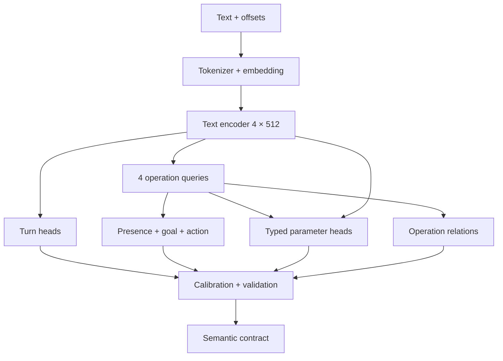

# Đặc tả kiến trúc Model 2 — Text → Act, Goal, Action, Parameters và Confidence

Tài liệu liên quan: [Model 1 — Audio → Waveform → ASR → Text]("ASRModel_architecture.md").

## 1. Phạm vi và mô hình ngữ nghĩa

Model 2 biểu diễn yêu cầu bằng act ở cấp lượt nói và các operation có cấu trúc. `OPEN_APP` không thuộc tập act; thao tác mở ứng dụng được biểu diễn bằng action trong domain tương ứng. Cấu hình cơ sở hỗ trợ tối đa `max_operations=4` trong một lượt.

| Khái niệm | Cấu hình tham chiếu | Định nghĩa |
| --- | --- | --- |
| Act | 6 nhãn trong `ACTS` | Loại hành vi hội thoại/điều phối |
| Domain | 4 nhãn trong `ROOT_ACTION_DOMAINS` | Miền thao tác |
| Goal | Có `goal_min_confidence`, không có `GOALS`/`ontology.goals` | Goal là domain của từng operation |
| Action | 37 entry trong `capabilities[domain].actions` | Thao tác cụ thể trong domain |
| Parameter slot | 42 entry theo từng action | Một vị trí tham số của một action |
| Operation | `max_operations=4` | Một đơn vị gồm goal + action + parameters |

**Ví dụ biểu diễn:** “mở Chrome” → `act=EXECUTE`, `goal=APPLICATION_CONTROL`, `action=OPEN`, `canonical_action=APPLICATION_CONTROL.OPEN`, `application=Chrome`.

Goal là root domain của từng operation. Goal và domain sử dụng cùng một nguồn nhãn; `num_goals = len(manifest["domains"])`. Tính tương thích giữa quy ước này và contract production phải được xác minh tại adapter của runtime cũ trước khi tích hợp.

## 2. Ontology cơ sở

### 2.1. Sáu act

ID cơ sở tuân theo thứ tự list `ACTS`. Cấu hình tham chiếu khai báo tên nhãn; các quy tắc annotation trong bảng quy định cách sử dụng nhãn trong kiến trúc mục tiêu.

| ID | Act | Quy tắc gán nhãn |
| --- | --- | --- |
| 0 | `EXECUTE` | Yêu cầu thực hiện thao tác; cần ít nhất một operation có thể diễn giải |
| 1 | `ASK_CLARIFICATION` | Yêu cầu chưa đủ rõ để lập kế hoạch; cần xác định thông tin thiếu |
| 2 | `CONFIRM` | Người dùng xác nhận một yêu cầu/đề nghị đang chờ; cần context |
| 3 | `CANCEL` | Hủy tác vụ hoặc ý định được tham chiếu |
| 4 | `RESPOND` | Yêu cầu phản hồi hội thoại trong phạm vi hỗ trợ; head này không tự sinh câu trả lời |
| 5 | `UNSUPPORTED` | Ý định ngoài phạm vi semantic được hỗ trợ |

Phải phân biệt **act model dự đoán** và **quyết định hỏi lại của Harness**. Ví dụ act dự đoán EXECUTE có confidence thấp có thể khiến Harness hỏi lại; không sửa nhãn dự đoán trong log thành ASK_CLARIFICATION để che lỗi model.

`UNSUPPORTED` khác `PROVIDER_UNAVAILABLE`: một intent có thể được hiểu đúng nhưng máy chưa có công cụ thực thi. Trạng thái khả dụng của công cụ thuộc trách nhiệm Harness/Registry và không tạo thêm act trong ontology cơ sở.

Kiến trúc mục tiêu dự đoán một act cho mỗi lượt nói. Cấu hình tham chiếu không xác định vị trí act head trong implementation cũ. Lượt nói chứa nhiều act, chẳng hạn “hủy việc cũ rồi mở Chrome”, phải được tách thành các lượt/plan hoặc xử lý bằng contract mở rộng có act theo operation. Việc gán act toàn lượt phải bảo toàn toàn bộ yêu cầu.

### 2.2. Bốn goal/domain và 37 action

| Goal/domain | Số action | Số parameter slot |
| --- | ---: | ---: |
| `APPLICATION_CONTROL` | 9 | 10 |
| `WEB_CONTROL` | 17 | 27 |
| `SYSTEM_CONTROL` | 10 | 3 |
| `RUN_COMMAND` | 1 | 2 |
| **Tổng** | **37** | **42** |

`EXECUTE` trong `ACTS` và action path `RUN_COMMAND.EXECUTE` nằm ở hai tầng khác nhau. Các action path như `TAB.CLOSE`, `MEDIA.SET_VOLUME` có dấu chấm bên trong: tách canonical ID ở dấu chấm đầu tiên hoặc dùng manifest; không giả định ID luôn có đúng hai đoạn.

### 2.3. Danh sách action và schema đầy đủ

Danh mục action và parameter dưới đây tương ứng với `get_config()`. Các slot giữ nguyên định danh theo action. ID số thuộc cấu hình cơ sở; ánh xạ phải được lưu cùng quá trình huấn luyện.

| ID theo thứ tự config | Canonical action | Parameters |
| --- | --- | --- |
| 0 | `APPLICATION_CONTROL.OPEN` | `application` (ENTITY; required; state: state.current_target_application) |
| 1 | `APPLICATION_CONTROL.CLOSE` | `application` (ENTITY; required; state: state.current_target_application) |
| 2 | `APPLICATION_CONTROL.FOCUS` | `application` (ENTITY; required; state: state.current_target_application) |
| 3 | `APPLICATION_CONTROL.PLAY` | `application` (ENTITY; required; state: state.current_target_application); `query` (FREE_TEXT; required) |
| 4 | `APPLICATION_CONTROL.PAUSE` | `application` (ENTITY; optional; state: state.current_target_application) |
| 5 | `APPLICATION_CONTROL.RESUME` | `application` (ENTITY; optional; state: state.current_target_application) |
| 6 | `APPLICATION_CONTROL.STOP` | `application` (ENTITY; optional; state: state.current_target_application) |
| 7 | `APPLICATION_CONTROL.NEXT` | `application` (ENTITY; optional; state: state.current_target_application) |
| 8 | `APPLICATION_CONTROL.PREVIOUS` | `application` (ENTITY; optional; state: state.current_target_application) |
| 9 | `WEB_CONTROL.OPEN` | `target` (FREE_TEXT; required; state: state.active_url); `browser` (ENTITY; optional; state: state.active_browser) |
| 10 | `WEB_CONTROL.SEARCH` | `query` (FREE_TEXT; required); `browser` (ENTITY; optional; state: state.active_browser); `engine` (ENTITY; optional) |
| 11 | `WEB_CONTROL.BACK` | `browser` (ENTITY; optional; state: state.active_browser) |
| 12 | `WEB_CONTROL.FORWARD` | `browser` (ENTITY; optional; state: state.active_browser) |
| 13 | `WEB_CONTROL.REFRESH` | `browser` (ENTITY; optional; state: state.active_browser) |
| 14 | `WEB_CONTROL.SCROLL_UP` | `amount` (NUMBER; optional; min=1; max=10); `browser` (ENTITY; optional; state: state.active_browser) |
| 15 | `WEB_CONTROL.SCROLL_DOWN` | `amount` (NUMBER; optional; min=1; max=10); `browser` (ENTITY; optional; state: state.active_browser) |
| 16 | `WEB_CONTROL.TAB.NEW` | `browser` (ENTITY; optional; state: state.active_browser) |
| 17 | `WEB_CONTROL.TAB.CLOSE` | `tab_index` (NUMBER; optional); `tab_query` (FREE_TEXT; optional); `tab_reference` (CONTEXT_REFERENCE; optional; context: FOCUSED_ACTION, ACTIVE_ACTION, LAST_ACTION) |
| 18 | `WEB_CONTROL.TAB.SWITCH` | `tab_index` (NUMBER; optional); `tab_query` (FREE_TEXT; optional); `tab_reference` (CONTEXT_REFERENCE; optional; context: FOCUSED_ACTION, ACTIVE_ACTION, LAST_ACTION) |
| 19 | `WEB_CONTROL.TAB.REOPEN` | Không có |
| 20 | `WEB_CONTROL.PLAY` | `query` (FREE_TEXT; required); `site` (ENTITY; optional); `browser` (ENTITY; optional; state: state.active_browser) |
| 21 | `WEB_CONTROL.PAUSE` | `browser` (ENTITY; optional; state: state.active_browser) |
| 22 | `WEB_CONTROL.RESUME` | `browser` (ENTITY; optional; state: state.active_browser) |
| 23 | `WEB_CONTROL.STOP` | `browser` (ENTITY; optional; state: state.active_browser) |
| 24 | `WEB_CONTROL.NEXT` | `browser` (ENTITY; optional; state: state.active_browser) |
| 25 | `WEB_CONTROL.PREVIOUS` | `browser` (ENTITY; optional; state: state.active_browser) |
| 26 | `SYSTEM_CONTROL.MEDIA.SET_VOLUME` | `volume` (NUMBER; required; min=0; max=100) |
| 27 | `SYSTEM_CONTROL.MEDIA.VOLUME_UP` | `amount` (NUMBER; optional; min=1; max=100) |
| 28 | `SYSTEM_CONTROL.MEDIA.VOLUME_DOWN` | `amount` (NUMBER; optional; min=1; max=100) |
| 29 | `SYSTEM_CONTROL.MEDIA.MUTE` | Không có |
| 30 | `SYSTEM_CONTROL.MEDIA.UNMUTE` | Không có |
| 31 | `SYSTEM_CONTROL.POWER.LOCK` | Không có |
| 32 | `SYSTEM_CONTROL.POWER.SHUTDOWN` | Không có |
| 33 | `SYSTEM_CONTROL.POWER.RESTART` | Không có |
| 34 | `SYSTEM_CONTROL.POWER.SLEEP` | Không có |
| 35 | `SYSTEM_CONTROL.SCREENSHOT.CAPTURE` | Không có |
| 36 | `RUN_COMMAND.EXECUTE` | `command_id` (ENTITY; required); `arguments` (FREE_TEXT; optional) |

### 2.4. Định danh và kiểu parameter slot

Có **13 tên tham số duy nhất**: `amount`, `application`, `arguments`, `browser`, `command_id`, `engine`, `query`, `site`, `tab_index`, `tab_query`, `tab_reference`, `target`, `volume`.

Một slot được định danh bằng `(canonical_action, parameter_name)`. `APPLICATION_CONTROL.OPEN.application` và `APPLICATION_CONTROL.CLOSE.application` là hai slot dù cùng tên. Phân bố kiểu trong cấu hình cơ sở: ENTITY 26, FREE_TEXT 7, NUMBER 7, CONTEXT_REFERENCE 2.

`PARAMETER_TYPES` cho phép 7 kiểu: ENUM, NUMBER, ENTITY, FREE_TEXT, BOOLEAN, STATE_REFERENCE, CONTEXT_REFERENCE. ENUM, BOOLEAN, STATE_REFERENCE chưa được khai báo như **type trực tiếp** ở slot mặc định. Tuy vậy state reference đã được cho phép làm nguồn của ENTITY/FREE_TEXT qua `state_reference_paths`.

## 3. Ràng buộc tương thích cấu hình

| Đặc điểm của cấu hình tham chiếu | Yêu cầu triển khai |
| --- | --- |
| Architecture hiện là `voice_native_slu_v1` | Không đưa nguyên config này vào text-only model rồi cho rằng đã migrate |
| `goal_min_confidence` có, ontology goal riêng không có | Áp dụng goal=domain; giữ một nguồn nhãn trong ontology và version contract |
| `confidence: 0.25` trong `loss_weights` | Chỉ khai báo weight; chưa cho biết target confidence |
| Không stage nào có `confidence` trong `enabled_losses` | Trainer duyệt stage list chỉ tính các loss được liệt kê; hành vi implementation phải được kiểm chứng |
| `bridge_alignment` chỉ có ở BRIDGE | Định nghĩa target/loss chưa nằm trong config; không tự bịa ra objective |
| `parameter_presence_negative_weight`, `parameter_hard_negative_schemas` cùng nằm trong `loss_weights` | Đây là hyperparameter phụ, không phải hai loss tensor độc lập |
| Validator V1 khóa 6 act, 4 domain, 37 action, 42 slot | Bản mở rộng thay bằng validator cấu trúc, IDs và schema; không khóa các tổng này |
| Comment nói tab targets loại trừ nhau | Validator hiện chưa enforce mutual exclusion |
| `tab_index` chỉ có mô tả one-based | Chưa khai báo minimum=1 hoặc ràng buộc số nguyên |
| Chưa có text tokenizer, max length, label manifest | Phải thêm cho Model 2 mới |
| Chưa validate đầy đủ `schema_order`/threshold và kích thước liên khối | Cần validator mới; không chỉ kiểm tra chia hết attention heads |

Các ràng buộc trên mô tả phạm vi của cấu hình tham chiếu. Trạng thái đáp ứng của runtime phải được kiểm chứng độc lập.

## 4. Kiến trúc xử lý text



Giữ ý tưởng `semantic_core` 4 lớp × 512, 8 heads, FFN 2048, dropout 0.1 và operation decoder 4 learned queries trong config. Thay đường nhận audio bằng text embedding có positional information.

Không bắt buộc nén text về 32 latent tokens như `semantic_resampler` cũ. Để copy ENTITY/FREE_TEXT chính xác, parameter head truy cập trực tiếp hidden states của text gốc. Nếu sau này dùng resampler, vẫn giữ nhánh text-token memory và offset mapping cho span extraction.

Có hai phương án initialization:

- **Bám config, train từ đầu:** tokenizer riêng + embedding 512 + Transformer 4 lớp. Mã khung bên dưới mô tả phương án này.
- **Fine-tune pretrained text encoder:** giữ tokenizer và encoder gốc; dùng projection `hidden_size → 512` nếu cần để nối operation heads. Không thêm bốn lớp nữa một cách mặc định hoặc giả định pretrained model có cùng tensor keys.

Tất cả head dưới đây thuộc **một Model 2**; không phải mỗi head là một model độc lập.

## 5. Tensor contract

Ký hiệu: `B` batch, `L` text tokens sau padding, `D` hidden size; `C_act`, `G`, `A`, `S` lần lượt là số act, goal/domain, action, parameter slots đọc từ manifest; `K` là giới hạn operations. Cấu hình cơ sở: `D=512`, `K=4`, `C_act=6`, `G=4`, `A=37`, `S=42`, `R=6`. Các shape dưới dùng số của cấu hình cơ sở để đối chiếu, không phải hằng số bắt buộc trong source code.

| Output nội bộ | Shape | Loss/ý nghĩa |
| --- | --- | --- |
| `token_states` | `[B,L,512]` | Memory cho attention và pointers |
| `turn_state` | `[B,512]` | Masked pooling của câu |
| `act_logits` | `[B,6]` | CE act |
| `turn_relation_logits` | `[B,7]` | CE turn relation |
| `context_required_logit` | `[B]` | BCE nhu cầu resolve context |
| `context_reference_logits` | `[B,6]` | CE loại reference ở mức turn; mask nếu không áp dụng |
| `ood_logit` | `[B]` | BCE in/out-of-scope với nhãn được định nghĩa rõ |
| `operation_states` | `[B,4,512]` | Một state cho mỗi operation slot |
| `presence_logits` | `[B,4]` | BCE operation tồn tại |
| `goal_logits` | `[B,4,4]` | CE domain; dùng tên loss cũ `operation_domain_retrieval` |
| `action_logits` | `[B,4,37]` | CE action, mask theo domain |
| `slot_presence_logits` | `[B,4,42]` | Tham số có được đề cập/biểu diễn không? |
| `source_logits` | `[B,4,42,3]` | INPUT_SPAN / STATE_REFERENCE / CONTEXT_REFERENCE |
| `span_start`, `span_end` | `[B,4,42,L]` | Pointer vào tokens của input |
| `state_path_logits` | `[B,4,42,3]` | Ba state paths hiện có; mask theo slot |
| `slot_context_logits` | `[B,4,42,6]` | Context reference của parameter |
| `operation_relation_logits` | `[B,4,4,5]` | Quan hệ operation i với j |

Cấu hình cơ sở có 3 state paths duy nhất: `state.current_target_application`, `state.active_browser`, `state.active_url`. Số state paths và số slot phải được lấy từ manifest; các giá trị cơ sở 3 và 42 không được hardcode trong các module.

Dạng tổng quát: act `[B,C_act]`, goal `[B,K,G]`, action `[B,K,A]`, slot presence `[B,K,S]`, pointers `[B,K,S,L]`. Shape tự đổi theo manifest khi build model mới. Các shape xác định hợp đồng tensor của kiến trúc mục tiêu; implementation phải được kiểm chứng theo hợp đồng này.

## 6. Config động và manifest giữ nguyên ID

Toàn bộ code trong mục này thuộc `nlu/config.py`. Các tổng 6/4/37/42 chỉ dùng kiểm tra cấu hình cơ sở khi migration, không dùng để từ chối cấu hình mở rộng.

### 6.1. Validator kiểm tra cấu trúc

`create_config()` tạo cấu hình khởi đầu, `load_config()` đọc bản đã lưu, `save_config()` validate rồi ghi nguyên tử. Dữ liệu ontology nằm trong config thay vì kiểm tra bằng equality với các list cố định cấp module.

```python
def validate_nlu_config(config):
    ontology = config["ontology"]
    acts = ontology["acts"]
    domains = ontology["root_action_domains"]
    order = ontology["schema_order"]
    caps = ontology["capabilities"]
    for label, values in (("acts", acts), ("domains", domains), ("schema_order", order)):
        if not values or any(not isinstance(x, str) or not x.strip() for x in values):
            raise ValueError(f"Invalid {label}")
        if len(values) != len(set(values)):
            raise ValueError(f"Duplicate {label}")
    if set(order) != set(domains) or set(caps) != set(domains):
        raise ValueError("Domain/order/capability mismatch")
    allowed_types = {"ENUM", "NUMBER", "ENTITY", "FREE_TEXT", "BOOLEAN", "STATE_REFERENCE", "CONTEXT_REFERENCE"}
    seen = set()
    for domain in order:
        if "." in domain:
            raise ValueError("Root domain must not contain dots")
        actions = caps[domain]["actions"]
        if not isinstance(actions, dict) or not actions:
            raise ValueError("Each domain requires at least one action")
        for path, spec in actions.items():
            if not isinstance(path, str) or not path or any(not part for part in path.split(".")):
                raise ValueError("Invalid action path")
            canonical = f"{domain}.{path}"
            if canonical in seen:
                raise ValueError("Duplicate action")
            seen.add(canonical)
            if not isinstance(spec.get("parameters"), dict):
                raise ValueError("Missing parameter schema")
            for name, p in spec["parameters"].items():
                if not isinstance(name, str) or not name or "." in name:
                    raise ValueError("Invalid parameter name")
                if p["type"] not in allowed_types or not isinstance(p["required"], bool):
                    raise ValueError("Invalid parameter type/required")
                if p["type"] == "ENUM" and not p.get("values"):
                    raise ValueError("ENUM requires values")
                if "minimum" in p and "maximum" in p and p["minimum"] > p["maximum"]:
                    raise ValueError("Invalid numeric range")
    if config["operation_decoder"]["max_operations"] < 1:
        raise ValueError("max_operations must be positive")
```

Đây là validator tối thiểu cho phần mở rộng. Trong cùng `config.py` vẫn phải kiểm tra architecture/profile version, dimensions/head divisibility, thresholds, allowed references, duplicate enum values và constraint liên slot. Không dùng `validate_config()` V1 nguyên bản cho profile mới.

### 6.2. Bảo toàn ID khi mở rộng nhãn

Flatten lại toàn ontology sau khi thêm action vào một domain có thể dịch chuyển ID của các action thuộc domain phía sau. **Manifest đi cùng checkpoint là nguồn ánh xạ ID có thẩm quyền.** Thứ tự duyệt config không được sử dụng để tái cấp ID cho nhãn đã có weights.

```python
import copy

def preserve_ids(old_names, candidate_names, label):
    if len(old_names) != len(set(old_names)) or len(candidate_names) != len(set(candidate_names)):
        raise ValueError(f"Duplicate {label}")
    missing = set(old_names) - set(candidate_names)
    if missing:
        raise ValueError(f"Removal/rename requires explicit migration: {label}")
    old_set = set(old_names)
    return list(old_names) + [x for x in candidate_names if x not in old_set]

def build_registry(config, previous=None):
    validate_nlu_config(config)
    previous = previous or {}
    o = config["ontology"]
    acts = preserve_ids(previous.get("acts", []), o["acts"], "acts")
    domains = preserve_ids(previous.get("domains", []), o["schema_order"], "domains")
    candidates, slot_specs, state_candidates = [], {}, []
    for domain in o["schema_order"]:
        for path, spec in o["capabilities"][domain]["actions"].items():
            canonical = f"{domain}.{path}"
            candidates.append(canonical)
            for name, parameter in spec["parameters"].items():
                key = f"{canonical}.{name}"
                slot_specs[key] = {"canonical": canonical, "name": name, "schema": copy.deepcopy(parameter)}
                for state_path in parameter.get("state_reference_paths", []):
                    if state_path not in state_candidates:
                        state_candidates.append(state_path)
    actions = preserve_ids(previous.get("actions", []), candidates, "actions")
    old_slots = previous.get("slots", [])
    slot_keys = preserve_ids([s["key"] for s in old_slots], list(slot_specs), "slots")
    # Expansion mode refuses silently changing old parameter semantics.
    for old_slot in old_slots:
        old_schema = {k: v for k, v in old_slot["schema"].items() if k != "description"}
        new_schema = {k: v for k, v in slot_specs[old_slot["key"]]["schema"].items() if k != "description"}
        if old_schema != new_schema:
            raise ValueError("Existing slot schema changed; use schema migration")
    action_ids = {name: i for i, name in enumerate(actions)}
    domain_ids = {name: i for i, name in enumerate(domains)}
    slots = []
    for key in slot_keys:
        item = slot_specs[key]
        slots.append({"key": key, "name": item["name"],
                      "action_id": action_ids[item["canonical"]], "schema": item["schema"]})
    return {
        "acts": acts, "domains": domains, "actions": actions,
        "action_to_domain": [domain_ids[name.split(".", 1)[0]] for name in actions],
        "slots": slots,
        "state_paths": preserve_ids(previous.get("state_paths", []), state_candidates, "state_paths"),
        "context_types": preserve_ids(previous.get("context_types", []), config["relations"]["context_reference_types"], "context_types"),
    }
```

Sau khi đã có weights: `new_registry = build_registry(new_config, previous=checkpoint_registry)`. Không gọi không có `previous` rồi giả định ID giữ nguyên. Turn/operation relation vocab cũng cần manifest và kiểm tra tương thích; bản mở rộng act/domain/action/slot này giữ các vocab quan hệ đó không đổi.

Lưu config, manifest, hash và ontology version cùng checkpoint. Không sửa semantics của nhãn cũ dưới cùng ID; thêm nhãn mới hoặc làm migration có chủ đích. Thay description đơn thuần không đổi tensor, nhưng thay ý nghĩa nghiệp vụ vẫn phải được đánh giá thủ công.

Trong cấu hình tham chiếu V1, một số object parameter được tái sử dụng. `build_registry()` deepcopy từng slot; khi chỉnh config cần detach object dùng chung trước khi sửa riêng một slot.

## 7. Forward và các head đầu ra

Mã tham chiếu xác định các head và luồng tensor trong forward. Dataset, optimizer, constrained decode, serializer, scalar parser, calibration và pretrained loading được triển khai tại các thành phần tương ứng. `vocab_size`, `pad_id`, `max_length` phải được lấy từ tokenizer/config; cấu hình tham chiếu V1 không quy định max length.

```python
import math
import torch
from torch import nn

class TextSemanticModel(nn.Module):
    def __init__(self, config, registry, vocab_size, pad_id, max_length):
        super().__init__()
        c = config["semantic_core"]
        d = c["d_model"]
        k = config["operation_decoder"]["max_operations"]
        s = len(registry["slots"])
        if not 0 <= pad_id < vocab_size:
            raise ValueError("Tokenizer must define a valid PAD ID")
        self.max_length, self.d = max_length, d
        self.token_embedding = nn.Embedding(vocab_size, d, padding_idx=pad_id)
        self.position_embedding = nn.Embedding(max_length, d)
        layer = nn.TransformerEncoderLayer(
            d_model=d, nhead=c["attention_heads"],
            dim_feedforward=c["d_ff"], dropout=c["dropout"],
            batch_first=True, norm_first=True,
        )
        self.encoder = nn.TransformerEncoder(layer, num_layers=c["layers"])
        self.op_queries = nn.Parameter(torch.randn(k, d) * 0.02)
        self.op_attention = nn.MultiheadAttention(
            d, config["operation_decoder"]["attention_heads"],
            dropout=config["operation_decoder"]["dropout"], batch_first=True,
        )
        self.op_norm = nn.LayerNorm(d)
        self.act = nn.Linear(d, len(registry["acts"]))
        self.turn = nn.Linear(d, len(config["relations"]["turn"]))
        self.context_required = nn.Linear(d, 1)
        self.turn_context = nn.Linear(d, len(registry["context_types"]))
        self.ood = nn.Linear(d, 1)
        self.presence = nn.Linear(d, 1)
        self.goal = nn.Linear(d, len(registry["domains"]))
        self.action = nn.Linear(d, len(registry["actions"]))
        self.slot_embedding = nn.Embedding(s, d)
        self.slot_fuse = nn.Sequential(nn.Linear(d, d), nn.GELU(), nn.LayerNorm(d))
        self.slot_presence = nn.Linear(d, 1)
        self.source = nn.Linear(d, 3)
        self.start_query = nn.Linear(d, d)
        self.end_query = nn.Linear(d, d)
        self.state_path = nn.Linear(d, len(registry["state_paths"]))
        self.slot_context = nn.Linear(d, len(registry["context_types"]))
        self.op_relation = nn.Linear(2 * d, len(config["relations"]["operation"]))
        action_domain = torch.tensor(registry["action_to_domain"], dtype=torch.long)
        self.register_buffer("action_domain", action_domain)

    def forward(self, input_ids, attention_mask):
        # attention_mask: True ở token thật; key_padding_mask dùng nghĩa ngược lại.
        valid = attention_mask.bool()
        b, length = input_ids.shape
        if length > self.max_length or (~valid.any(dim=1)).any():
            raise ValueError("Input too long or contains an empty sequence")
        pos = torch.arange(length, device=input_ids.device)
        h = self.token_embedding(input_ids) + self.position_embedding(pos)[None]
        h = self.encoder(h, src_key_padding_mask=~valid)
        h = h.masked_fill(~valid[..., None], 0)
        turn_state = h.sum(1) / valid.sum(1, keepdim=True)
        q = self.op_queries[None].expand(b, -1, -1)
        attended, _ = self.op_attention(q, h, h, key_padding_mask=~valid, need_weights=False)
        op = self.op_norm(q + attended)  # [B,K,D]
        slot = self.slot_fuse(op[:, :, None, :] + self.slot_embedding.weight[None, None])
        start = torch.einsum("bksd,bld->bksl", self.start_query(slot), h) / math.sqrt(self.d)
        end = torch.einsum("bksd,bld->bksl", self.end_query(slot), h) / math.sqrt(self.d)
        start = start.masked_fill(~valid[:, None, None, :], float("-inf"))
        end = end.masked_fill(~valid[:, None, None, :], float("-inf"))
        k = op.size(1)
        left = op[:, :, None, :].expand(-1, -1, k, -1)
        right = op[:, None, :, :].expand(-1, k, -1, -1)
        return {
            "act_logits": self.act(turn_state),
            "turn_relation_logits": self.turn(turn_state),
            "context_required_logit": self.context_required(turn_state).squeeze(-1),
            "context_reference_logits": self.turn_context(turn_state),
            "ood_logit": self.ood(turn_state).squeeze(-1),
            "presence_logits": self.presence(op).squeeze(-1),
            "goal_logits": self.goal(op), "action_logits": self.action(op),
            "slot_presence_logits": self.slot_presence(slot).squeeze(-1),
            "source_logits": self.source(slot),
            "span_start_logits": start, "span_end_logits": end,
            "state_path_logits": self.state_path(slot),
            "slot_context_logits": self.slot_context(slot),
            "operation_relation_logits": self.op_relation(torch.cat([left, right], -1)),
        }

    def mask_actions(self, action_logits, goal_ids):
        # goal_ids [B,K]; dùng gold goal khi teacher-forcing, predicted goal khi decode.
        allowed = self.action_domain[None, None, :] == goal_ids[..., None]
        return action_logits.masked_fill(~allowed, float("-inf"))
```

`key_padding_mask=True` nghĩa là bỏ qua vị trí đó trong `MultiheadAttention`; không dùng nhầm với một số API attention khác có quy ước ngược lại. [R1]

Các lớp Transformer được clone từ layer mẫu cần initialization phù hợp nếu train từ đầu; xác minh chính sách khởi tạo theo phiên bản PyTorch. Mã tham chiếu chưa bật gradient checkpointing chỉ vì config có cờ đó.

Span logits trên special tokens cũng phải bị mask trong loss/decoder bằng `span_valid_mask` lấy từ offsets; attention vẫn có thể dùng special tokens. `attention_mask` một mình chỉ loại padding, chưa đủ xác định vị trí có thể copy.

## 8. Từ operation queries đến goal/action

### 8.1. Operation presence

`sigmoid(presence_logits[b,k])` biểu thị slot k có operation. Threshold trong cấu hình cơ sở là 0.50. Train BCE cả slot có và không có operation; chỉ tính loss goal/action/parameter ở slot có nhãn hợp lệ.

Operations được gán theo thứ tự xuất hiện/quan hệ trong annotation, điền liên tiếp vào các slot đầu rồi pad. Đây là fixed-order supervision, không dùng Hungarian matching trong baseline. Learned queries không tự bảo đảm giữ thứ tự nếu dataset không có quy ước nhất quán.

Giới hạn bốn slot không tự phát hiện câu có năm operations. Cần dữ liệu overflow và detector/count head bổ sung hoặc cơ chế tách đầu vào; không được truncate âm thầm. Trước khi có xử lý này, đưa câu vượt phạm vi về bước yêu cầu tách yêu cầu.

### 8.2. Goal/domain head

Goal head thực hiện classification domain từ operation state; cấu hình cơ sở có bốn domain. Loss sử dụng CE và giữ key `operation_domain_retrieval` để liên kết với cấu hình tham chiếu. Lựa chọn classifier này thuộc kiến trúc mục tiêu; thuật toán trong implementation cũ cần được xác minh riêng.

### 8.3. Action head

Head có 37 output canonical actions; logits được mask theo domain. Train action theo gold domain trước, sau đó đo lỗi ở điều kiện predicted domain để thấy sai số lan truyền.

Quy trình decode có ràng buộc:

1. Xếp hạng domain từ goal head.
2. Tính phân phối action hợp lệ của từng domain candidate.
3. Xếp hạng cặp bằng `log P(domain|text,op) + log P(action|domain,text,op)`.
4. Chọn cặp tốt nhất, giải mã slot và kiểm tra schema.

Điểm cặp là score của mô hình phân cấp, chưa mặc định là confidence đã calibrated. Khi chọn qua beam cặp, lấy goal/action confidence ở **nhãn đã chọn**, không luôn lấy `max()` của head nếu nhãn cuối khác top-1 riêng lẻ.

Với RUN_COMMAND chỉ có một action EXECUTE, softmax action sau mask luôn bằng 1. Điều này chỉ nói action không có đối thủ trong domain; không chứng minh domain, command_id hoặc toàn lệnh đúng.

## 9. Trích xuất và chuẩn hóa typed parameters

### 9.1. Phân tách presence, source và value

Với mỗi slot của action đã chọn:

1. `slot_presence`: có đề cập giá trị hoặc reference hay không?
2. `source`: lấy từ INPUT_SPAN, STATE_REFERENCE hay CONTEXT_REFERENCE?
3. Value head/parser: lấy đúng nội dung tương ứng.
4. Validator: kiểu, range, enum, các constraint liên slot.

Presence thấp không đồng nghĩa confidence value thấp; khi không có value thì value confidence không tồn tại. Parameter thiếu bắt buộc được đánh dấu missing để Harness hỏi lại, không điền mặc định không có bằng chứng.

### 9.2. Cách build theo từng kiểu

| Kiểu schema | Head/bước cần build | Đầu ra trước Runtime |
| --- | --- | --- |
| ENTITY | Start/end span; hoặc state reference nếu schema cho phép | Alias gốc + nguồn; Runtime resolve ID |
| FREE_TEXT | Start/end span; giữ nguyên query/arguments | Chuỗi từ input, không diễn giải lại |
| NUMBER | Span + parser số tiếng Việt/đơn vị | Giá trị số chuẩn hóa và span gốc |
| CONTEXT_REFERENCE | Classifier loại reference + mask allowlist của slot | Selector semantic, chưa resolve object |
| STATE_REFERENCE | Classifier state path theo allowlist | Đường dẫn state được yêu cầu |
| ENUM | Head giá trị theo enum của slot | Enum value; cần bổ sung khi schema có kiểu này |
| BOOLEAN | Binary head hoặc enum hai giá trị có nhãn rõ | `true/false`; cần bổ sung khi schema có kiểu này |

Với NUMBER, không dùng `sigmoid × 100` cho mọi tham số: `volume`, `amount` và `tab_index` có miền và ý nghĩa khác nhau. Span+parser giúp giữ được số ngoài miền để validator phát hiện, thay vì clipping và thực hiện một giá trị khác.

Span decode phải chọn `start <= end` trên vị trí hợp lệ, chặn special/padding và giới hạn độ dài theo slot khi cần. Ghép token rồi detokenize có thể thay đổi chữ gốc; tốt hơn là dùng offsets để cắt trực tiếp text chuẩn hóa.

### 9.3. State và context

- `STATE_REFERENCE`: ví dụ `state.active_browser`; model chỉ chọn selector được cho phép.
- `CONTEXT_REFERENCE`: ví dụ `LAST_ACTION`; Harness xác định action instance tương ứng.
- `INPUT_SPAN`: ví dụ tên “Chrome” xuất hiện trong câu.

Một câu “đóng nó” có thể chưa đủ để xác định native app, tab hay web media nếu không có context. Text-only model không được suy luận như thể đã nhận trạng thái máy khi input không cung cấp thông tin đó. Nếu cần chọn đúng domain dựa vào lịch sử, thêm input context có cấu trúc ở version sau hoặc để Harness hỏi lại/resolve candidate; ghi rõ thay đổi input contract.

### 9.4. TAB.CLOSE và TAB.SWITCH

Ba target alternatives hiện có: `tab_index`, `tab_query`, `tab_reference`. Comment config nói chúng loại trừ nhau nhưng hàm validate chỉ đếm slot.

Mã tham chiếu cho validator:

```python
def validate_tab_target(parameters):
    names = ("tab_index", "tab_query", "tab_reference")
    present = [name for name in names if parameters.get(name) is not None]
    if len(present) > 1:
        raise ValueError("Conflicting tab targets")
    index = parameters.get("tab_index")
    if index is not None:
        if isinstance(index, bool) or not isinstance(index, int) or index < 1:
            raise ValueError("tab_index must be a positive integer")
    return {"needs_context": len(present) == 0}
```

Zero explicit target có thể được Harness resolve theo context nếu policy cho phép; config hiện không quy định hành vi đó. Không tự giả định “không có target” luôn có nghĩa tab đang mở. Nhiều target có thể xuất hiện do lời tự sửa; chỉ chọn target cuối nếu quy tắc correction được train/validate rõ, không dùng heuristic tùy tiện.

## 10. Confidence: định nghĩa ở từng tầng

### 10.1. Các ngưỡng hiện có

| Config key | Giá trị | Áp dụng đúng đối tượng |
| --- | ---: | --- |
| `act_min_confidence` | 0.70 | Act của turn |
| `goal_min_confidence` | 0.70 | Goal/domain của operation |
| `action_min_confidence` | 0.60 | Action của operation |
| `parameter_min_confidence` | 0.60 | Giá trị/reference parameter đã decode |
| `operation_presence_threshold` | 0.50 | Slot operation có tồn tại |
| `max_ood_score` | 0.50 | Score ngoài phân phối/phạm vi |

Các ngưỡng trên là giá trị mặc định của cấu hình cơ sở. Tính tối ưu của threshold và mức độ calibration phải được xác lập trên dữ liệu đánh giá.

### 10.2. Định nghĩa confidence

Act và goal là **nhãn rời rạc**. Confidence là score gắn với một dự đoán cụ thể. Không có “số lượng confidence class” tương ứng với sáu act hay bốn goal.

Với logits phân loại:

```python
import torch

def selected_class_confidence(logits, selected_ids, temperature):
    if temperature <= 0:
        raise ValueError("Temperature must be positive")
    probabilities = torch.softmax(logits / temperature, dim=-1)
    return probabilities.gather(-1, selected_ids[..., None]).squeeze(-1)
```

- Act confidence: ước lượng độ đúng của nhãn act trên input text.
- Goal confidence: độ đúng của domain ở operation cụ thể.
- Action confidence: độ đúng có điều kiện theo domain được dùng để mask.
- Presence score: operation/slot có tồn tại; chưa phải độ đúng của nội dung.
- Parameter confidence: cần định nghĩa là giá trị/reference **đã decode** đúng, không đồng nhất với giá trị softmax lớn nhất của span head.
- OOD score: khả năng ngoài phạm vi theo bài toán detector; không bằng `1 - act_confidence` một cách mặc định.

### 10.3. Quy trình calibration

Sau khi chọn checkpoint, freeze model và thu logits/predictions trên tập calibration riêng. Fit temperature dương cho act/goal/action bằng NLL trên nhãn đúng. Dùng cùng mask/decoder như inference. Temperature scaling là bước hiệu chỉnh, không làm model tự biết mọi mẫu OOD. [R2]

Nếu action logits được mask theo predicted domain sai, gold action có thể bị mask mất và NLL vô hạn. Fit calibration có điều kiện trên các mẫu domain đúng; đồng thời đo chất lượng cặp domain-action trên toàn bộ tập và sử dụng calibrator chung nếu muốn score cho canonical action. Không che lỗi domain trong báo cáo.

Đánh giá ECE/reliability bins, Brier score và error–coverage sau calibration. Tập calibration cần chứa transcript ASR thực và các case khó. Fit xong calibration mới chọn threshold trên phần development phù hợp; test cuối giữ nguyên để báo cáo.

### 10.4. Parameter confidence

Hai pointer head cho xác suất start/end, nhưng việc nhân hai xác suất không tự cho xác suất đúng span, parser và nguồn reference. Module đánh giá chất lượng value tuân theo quy trình:

1. Đóng model extractor và decoder.
2. Sinh các parameter candidate thật trên dữ liệu không dùng để fit extractor, hoặc dùng cross-fitting.
3. Tạo target `y_value=1` khi action/schema, source và value/reference đều khớp nhãn; ngược lại bằng 0.
4. Fit calibrator từ feature như score span, margin, source score, slot presence, type và kết quả parser/validator.
5. Đo calibration riêng theo type/độ khó khi đủ dữ liệu, rồi mới dùng threshold 0.60 như ứng viên ban đầu.

Ở giai đoạn chưa có calibrator value, có thể log `value_score` như một score xếp hạng và chọn threshold thực nghiệm; không gắn nhãn “xác suất đúng 90%” cho score chưa được kiểm định.

### 10.5. Confidence toàn operation/frame — tùy chọn

**Tùy chọn mở rộng:** một correctness head nhận các feature đã detach từ model đóng băng. Target `y_operation=1` chỉ khi goal, action và toàn bộ parameters/references của operation khớp nhãn. BCE loss có thể là:

```text
L_conf = BCEWithLogits(correctness_logit, y_operation)
```

Target phải được tính từ **prediction hiện tại so với ground truth**, không gán 1 cho mọi sample chỉ vì sample có nhãn đúng. Nếu dùng head này ở stage `CONFIDENCE` mới, thêm rõ `confidence` vào `enabled_losses`; nếu không xây head, bỏ weight không dùng hoặc ghi rõ chỉ dùng post-hoc calibration.

Không gọi operation confidence là xác suất tool thực thi thành công. Provider có thể lỗi dù semantic đúng. Không cộng/trung bình/nhân các score ở nhiều tầng và tự tuyên bố đó là xác suất đúng toàn pipeline.

## 11. Relations và multi-turn hiện có

### 11.1. Turn relations — 7 nhãn

`NEW`, `APPEND_AFTER`, `MODIFY`, `SUPERSEDE`, `CONTINUE`, `REPEAT`, `REFERENCE`.

Turn relation head có shape cơ sở `[B,7]` và nhận turn_state. Label policy cần ví dụ đối lập: MODIFY sửa một phần yêu cầu; SUPERSEDE thay thế yêu cầu trước; REPEAT lặp lại yêu cầu; REFERENCE chỉ tham chiếu. Cần dataset multi-turn hoặc context selector để phân biệt các câu phụ thuộc lịch sử, không trông đợi text đơn độc giải quyết hết.

### 11.2. Operation relations — 5 nhãn

`NONE`, `AFTER_SUCCESS`, `AFTER_FAILURE`, `AFTER_TERMINAL`, `AFTER_START`.

Head `[B,K,K,5]` mô tả operation i phụ thuộc operation j. Với baseline thứ tự văn bản, chỉ cho phép cạnh `j < i`; mask self-edge, slot không tồn tại và cạnh tương lai. Dùng NONE cho cặp hợp lệ nhưng không có dependency; Harness kiểm tra graph không chu trình.

“Mở Chrome rồi tìm PyTorch” có thể gán operation 1 AFTER_SUCCESS operation 0 nếu annotation quy định “rồi” yêu cầu thành công. Ngữ nghĩa của từ nối phải được định nghĩa trong quy tắc annotation; cấu hình tham chiếu chỉ liệt kê tên quan hệ.

### 11.3. Context reference types — 6 nhãn

`FOCUSED_ACTION`, `ACTIVE_ACTION`, `LAST_ACTION`, `FOCUSED_TASK_GROUP`, `LAST_TASK_GROUP`, `RECENT_ACTION`.

Hai slot `tab_reference` chỉ cho phép ba kiểu đầu theo schema riêng. Head global sáu lớp vẫn phải mask theo allowlist từng slot. Context reference level turn và parameter có thể dùng cùng vocabulary nhưng khác head/target; không tráo tensor nhãn giữa hai nơi.

## 12. Dataset, target và loss masks

### 12.1. Mẫu annotation đơn giản

Schema annotation của kiến trúc mục tiêu được quy định dưới đây. Tính tương thích với contract 2.0 phải được xác minh trước khi tích hợp:

```json
{
  "dataset_id": "commands_vi",
  "sample_id": "text-001",
  "text": "mở Chrome",
  "act": "EXECUTE",
  "turn_relation": "NEW",
  "context_required": false,
  "operations": [
    {
      "goal": "APPLICATION_CONTROL",
      "action": "OPEN",
      "parameters": {
        "application": {
          "source": "INPUT_SPAN",
          "char_start": 3,
          "char_end": 9,
          "value": "Chrome"
        }
      },
      "dependencies": []
    }
  ]
}
```

Offsets dùng `[start,end)` theo Unicode code point trên text chuẩn hóa đã lưu. Nếu tokenizer có normalization làm thay đổi chuỗi, phải có mapping về chuỗi này. Không giả định UTF-8 byte offset = Python string index.

### 12.2. Batch target

```text
act_y                         [B]
operation_presence_y          [B,K]
goal_y, action_y              [B,K]         (-100 ở slot không có operation)
slot_presence_y              [B,K,S]
source_y                     [B,K,S]       (-100 khi absent/not-applicable)
span_start_y, span_end_y      [B,K,S]       (-100 nếu không phải INPUT_SPAN)
state_path_y, slot_context_y [B,K,S]       (mask theo source)
turn_relation_y              [B]
context_required_y           [B]
context_reference_y          [B]           (mask khi không dùng)
operation_relation_y         [B,K,K]       (mask các cặp không hợp lệ)
ood_y                        [B]
```

`required=True` là constraint của schema, không phải nhãn “parameter luôn có trong câu”. Ví dụ “mở ứng dụng” thiếu application; annotation cần phản ánh thiếu thông tin để Harness hỏi lại.

### 12.3. Loss tổng của Model 2

```text
L_semantic = 1.0 L_act
           + 1.0 L_operation_presence
           + 1.0 L_goal
           + 1.0 L_action
           + 1.0 L_parameters
           + 0.5 L_turn_relation
           + 0.5 L_context_required
           + 0.5 L_context_reference
           + 0.5 L_operation_relations
           + 0.5 L_ood
```

Các trọng số lấy từ config; `L_goal` tương ứng key `operation_domain_retrieval` theo quy ước goal=domain. Mỗi loss chuẩn hóa theo số nhãn hợp lệ của chính nó, không cộng raw sum 42 slots với một act và để số slot chi phối gradient.

`L_parameters` cần khai báo thành phần rõ trong config mới: presence, source, start, end, state reference, context reference và enum/boolean khi dùng. Cấu hình tham chiếu không quy định trọng số nội bộ các thành phần này. Các loss phải được normalize; trọng số được lựa chọn bằng ablation và lưu thành cấu hình huấn luyện riêng.

Helper CE tránh NaN khi toàn bộ target bị ignore:

```python
import torch
import torch.nn.functional as F

def valid_cross_entropy(logits, targets, ignore_index=-100):
    flat_logits = logits.reshape(-1, logits.size(-1))
    flat_targets = targets.reshape(-1)
    valid = flat_targets.ne(ignore_index)
    if not valid.any():
        finite = torch.where(torch.isfinite(logits), logits, torch.zeros_like(logits))
        return finite.sum() * 0.0
    return F.cross_entropy(flat_logits[valid], flat_targets[valid])
```

Nếu còn target hợp lệ nhưng gold class bị mask `-inf`, đó là lỗi label/domain mask cần sửa; không thay loss vô hạn bằng 0 để tiếp tục train.

`parameter_presence_negative_weight=0.25` giảm trọng số negative presence theo thiết kế loss mới; `parameter_hard_negative_schemas=4` là số schema âm khó. Cấu hình tham chiếu không xác định schema âm ở cấp domain hay action. Cấu hình huấn luyện có thể sử dụng action schemas dễ nhầm lẫn và phải khai báo rõ lựa chọn này trong trainer. Không coi bốn schema âm là bốn nhãn class.

## 13. Tổ chức mã nguồn và huấn luyện

| File | Nội dung và API |
| --- | --- |
| `nlu/config.py` | `create_config`, `load_config`, `save_config`, `validate_nlu_config`, `preserve_ids`, `build_registry`; ontology, schema, manifest, thresholds, versions |
| `nlu/model.py` | Tokenizer wrapper và offsets, `TextSemanticModel`, typed heads, span/number/reference decoding, áp dụng calibration, output validator, `predict`, `load_for_inference` |
| `nlu/train.py` | Dataset/collate, label encoding, mọi loss, train/validate, metrics, fit calibration, save/resume checkpoint, `expand_from_checkpoint`, CLI |

Mọi code thuộc ba file này. Không tạo thêm file Python cho registry, parameters, losses, decode, contract, calibration hay evaluation. Cấu hình/tokenizer/manifest/weights có thể lưu thành tài nguyên không phải `.py`.

| Thành phần đặc tả | Vị trí code |
| --- | --- |
| Registry và validator config (mục 6) | `config.py` |
| Model/forward và decode (mục 7–9) | `model.py` |
| Công thức áp dụng confidence và validation output (mục 10) | `model.py` |
| Fit temperature/value/correctness calibrator | `train.py`; tham số đã fit lưu với checkpoint |
| Dataset, targets, loss, metrics (mục 12, 15) | `train.py` |
| Mở rộng nhãn và chuyển weights (mục 16) | Helper cấu hình trong `config.py`; migration train trong `train.py`; model mới build từ `model.py` |

Imports theo một chiều: `model.py` dùng `config.py`; `train.py` dùng cả hai. `config.py` không import PyTorch/model/trainer nếu không cần; `model.py` không import `train.py`. Tokenization/normalization/decoding dùng cho inference nằm ở `model.py` để train và inference không chạy hai implementation khác nhau.

Hai thư mục `asr/`, `nlu/` có thể là namespace packages, không cần file `__init__.py`. Chạy training từ thư mục cha qua `python -m nlu.train`; inference import `nlu.model`. Harness ghép hai model ở ngoài phạm vi ba file của từng model.

### 13.1. Thứ tự build

1. Áp dụng quy ước goal=domain và act ở cấp lượt nói.
2. Export manifest động; dùng 6/4/37/42 để kiểm tra cấu hình cơ sở một lần, không khóa tổng trong validator mở rộng.
3. Viết validator schema và unit checks cho TAB targets, references, range.
4. Chọn tokenizer; nếu train mới, chỉ fit corpus train. Lưu PAD/UNK/BOS/EOS và normalizer.
5. Build text encoder và heads; kiểm tra tensor shape, mask và gradient một batch.
6. Train overfit tập nhỏ có đủ act, nhiều operation và các parameter type hiện có.
7. Train semantic rồi parameter; sau đó fine-tune joint **các head của Model 2**.
8. Thêm dữ liệu OOD và lỗi ASR; đo riêng lỗi do Model 1 và Model 2.
9. Freeze checkpoint, fit calibration, chọn ngưỡng, kiểm tra với Harness.

### 13.2. Stages mới

| Stage | Loss bật | Ghi chú |
| --- | --- | --- |
| `SEMANTIC` | act, presence, goal, action, turn/context, operation relations | Giữ tên key tương ứng config |
| `PARAMETER` | parameters | Có thể freeze encoder ban đầu rồi mở dần |
| `SAFETY` | ood | Cần định nghĩa in/out và dữ liệu khó |
| `NLU_JOINT` | Tất cả loss semantic hợp lệ | Không có lexical/audio/bridge |
| `CALIBRATION` | Post-hoc calibration | Model chính đã đóng băng |
| `CONFIDENCE` tùy chọn | correctness/value head | Chỉ thêm khi đã định nghĩa target rõ |

Stage dispatch cần kiểm tra mọi enabled loss có implementation và weight. Không tự duyệt mọi key trong `loss_weights` vì có các hyperparameter phụ.

## 14. Contract output và inference

Payload đầu ra sử dụng schema dưới đây và serializer/adapter tương ứng. `CONTRACT_VERSION=2.0` chỉ được giữ khi tính tương thích với contract hiện có đã được kiểm chứng. Các giá trị score trong ví dụ mô tả định dạng, không biểu thị kết quả thực nghiệm.

```json
{
  "schema_version": "VALLS-TEXT-SLU-DRAFT-1",
  "act": "EXECUTE",
  "confidence": 0.95,
  "turn_relation": "NEW",
  "context_required": false,
  "context_reference": null,
  "ood_score": 0.03,
  "operations": [
    {
      "operation_index": 0,
      "presence_score": 0.98,
      "goal": "APPLICATION_CONTROL",
      "goal_confidence": 0.94,
      "action": "OPEN",
      "canonical_action": "APPLICATION_CONTROL.OPEN",
      "action_confidence": 0.93,
      "parameters": {
        "application": {
          "value": "Chrome",
          "source": "INPUT_SPAN",
          "span": [3, 9],
          "confidence": 0.92
        }
      },
      "missing_required_parameters": [],
      "dependencies": []
    }
  ]
}
```

Trong payload này, `confidence` ở cấp ngoài **chỉ là act confidence**; `parameters.application.confidence` là value confidence sau phương pháp kiểm định ở mục 10.4. Nếu chưa build calibrator value, xuất `value_score` và ghi status của score theo schema thay thế; không đưa số minh họa vào production như kết quả đã đạt.

Inference đi qua các bước:

1. Normalize text nhất quán; kiểm tra rỗng, quá dài, nhiều operations vượt phạm vi.
2. Tokenize kèm offsets và span-valid mask; chạy model ở eval.
3. Decode act, turn/context, OOD; lưu cả dự đoán và score trước policy.
4. Decode operations có presence, goal/action hợp lệ và quan hệ.
5. Decode parameter theo schema, chuẩn hóa number và kiểm tra references.
6. Calibrate score bằng version đúng; áp dụng từng threshold.
7. Validator kiểm tra kiểu/range/required/mutual exclusion/DAG.
8. Harness resolve state/context/capability và quyết định thực thi, hỏi lại hoặc từ chối.

Một required parameter thấp hơn ngưỡng phải khiến operation cần hỏi lại; không chỉ bỏ parameter rồi thực thi với default ngoài ý người dùng. CONFIRM/CANCEL có thể không chứa operation thực thi mới; cần reference tới việc đang chờ/tác vụ đích. RESPOND không đồng nghĩa module này có khả năng sinh câu trả lời.

## 15. Đánh giá gắn với dự án

| Cấp | Metric tối thiểu |
| --- | --- |
| Act 6 lớp | Macro-F1, confusion matrix, per-class recall |
| Goal 4 lớp | Accuracy/F1 trên operations thực; đo cả presence misses |
| Action 37 lớp | Canonical action exact match; tách oracle goal và predicted goal |
| Operation count/order | Exact match số operation và thứ tự; overflow, omission, duplicate |
| Parameters 42 slots | Presence F1, span/value exact match, required-slot missing rate |
| References | Đúng selector và tỷ lệ resolve thành công ở Harness |
| Relations | Turn relation F1, dependency edge/type F1, invalid graph rate |
| Confidence | ECE, Brier, reliability bins, risk–coverage theo cấp |
| OOD | False accept trên unknown, false reject trên lệnh hợp lệ |
| Full frame | Act + operations + actions + parameters + relations khớp annotation |
| End-to-end | Full-frame từ audio gốc, không chấm theo transcript ASR sai |
| Runtime | Latency tokenize/encoder/heads/decode và peak memory |

Bắt buộc so Model 2 trên transcript đúng với cùng model trên transcript ASR. Bộ test riêng cần có mở/đóng, phủ định, app so với website, native media so với web media, volume tuyệt đối so với bước tăng/giảm, TAB alternatives, câu thiếu parameter và lời xác nhận không có context.

Không báo accuracy cao bằng cách loại bỏ toàn bộ samples bị reject khỏi mẫu số. Báo cả coverage, lỗi trong số được chấp nhận và chất lượng tổng trên full test.

## 16. Mở rộng act, goal/domain, action và slot bằng fine-tune

### 16.1. Nguyên tắc mở rộng

Số nhãn được xác định theo ontology của từng phiên bản và không bị khóa bởi cấu hình cơ sở. Mỗi phiên bản model đã build vẫn có kích thước tensor cụ thể; mở rộng là tạo phiên bản model mới, chuyển trọng số tương thích, fine-tune và đánh giá lại. Không thay số output của weights đang chạy chỉ bằng cách đổi config khi inference.

Giới hạn thực tế là dữ liệu phân biệt nhãn, năng lực encoder, bộ nhớ, chi phí train và khả năng Runtime hỗ trợ chức năng mới. Cấu trúc ba file Python không làm giảm khả năng mở rộng này.

### 16.2. Phạm vi thay đổi theo loại mở rộng

| Thay đổi | `config.py` | `model.py` | `train.py` |
| --- | --- | --- | --- |
| Thêm act | Append nhãn, định nghĩa ý nghĩa và version | Build act head `D → C_act_new` | Nhãn/masks phù hợp, copy hàng cũ, train và calibrate act |
| Thêm goal/domain | Thêm root domain + capability/action schema, cập nhật manifest | Goal head `D → G_new`; cập nhật action-domain mask | Train goal và các action/slot mới, đo nhầm lẫn với domain cũ |
| Thêm action | Canonical key mới trong domain | Action head `D → A_new`; giữ mapping domain | Copy hàng cũ, train action mới + hard negatives |
| Thêm parameter slot | Slot key `(canonical_action, name)`, kiểu/required/constraints | Slot embedding `S_new × D`; typed head mới nếu cần | Presence/source/value targets, loss masks, dữ liệu thiếu/đủ tham số |

Trong mã tham chiếu, slot presence/source/span scorers dùng chung weights giữa các slot. Thêm slot thuộc **type đã được implement** chủ yếu tăng hàng slot embedding và schema masks; không cần thêm một classifier độc lập cho mỗi slot. Nếu slot dùng ENUM/BOOLEAN hoặc logic chưa có, phải implement value head/parser và loss tương ứng dù type đã nằm trong allowlist.

Chỉ thêm act không bắt buộc tăng goal/action/slot. Chỉ thêm domain không có action không có ý nghĩa đối với pipeline execute này, nên validator yêu cầu domain có ít nhất một action.

### 16.3. Ví dụ tăng cả bốn nhóm

Ví dụ mở rộng ontology, không đại diện cho chức năng đã triển khai: thêm act `PLAN`, domain `FILE_CONTROL`, action `FILE_CONTROL.OPEN` và slot required `path: ENTITY`. Sau cập nhật sẽ có **7 act / 5 domain / 38 action / 43 slot**.

```python
import copy

def example_expanded_config(base_config):
    config = copy.deepcopy(base_config)
    config["ontology_version"] = "VALLS-ONTOLOGY-EXPANSION-DEMO-1"
    ontology = config["ontology"]
    ontology["acts"].append("PLAN")
    ontology["root_action_domains"].append("FILE_CONTROL")
    ontology["schema_order"].append("FILE_CONTROL")
    ontology["capabilities"]["FILE_CONTROL"] = {
        "description": "Illustrative file operations; provider must be implemented.",
        "actions": {
            "OPEN": {
                "description": "Open a file identified by the user.",
                "parameters": {
                    "path": {"type": "ENTITY", "required": True,
                             "description": "File path or alias supplied by the user."}
                },
            }
        },
    }
    validate_nlu_config(config)
    return config
```

`PLAN` cần annotation/policy riêng, chẳng hạn “chỉ lập kế hoạch, chưa chạy”, để phân biệt với EXECUTE. Đổi semantic behavior của act cần Runtime hiểu act đó. Các nhãn trong ví dụ không thuộc ontology production mặc định; việc đưa vào production phải tuân theo quy trình mở rộng và kiểm chứng.

Khi thêm action vào domain đã tồn tại, registry phải giữ nguyên ID cũ. Với cách flatten cũ, thêm vào APPLICATION_CONTROL có thể dịch IDs của WEB_CONTROL; `build_registry(new_config, previous=old_manifest)` ở mục 6 khắc phục việc này.

### 16.4. Chuyển trọng số theo định danh nhãn

Phần này thuộc `nlu/train.py`. Build **new_model** bằng config/manifest mới trước. Đối với linear classifier, mỗi hàng weight và bias tương ứng một nhãn. Slot embedding cũng copy theo slot key.

```python
def row_transfer_plan(old_labels, new_labels):
    if len(set(old_labels)) != len(old_labels) or len(set(new_labels)) != len(new_labels):
        raise ValueError("Duplicate labels")
    positions = {label: i for i, label in enumerate(new_labels)}
    if not set(old_labels) <= set(new_labels):
        raise ValueError("Expansion cannot silently remove labels")
    return [(old_i, positions[label]) for old_i, label in enumerate(old_labels)]
```

Code PyTorch để copy một head/embedding (gọi sau khi kiểm tra manifest):

```python
import torch

@torch.no_grad()
def transfer_linear(old_head, new_head, old_labels, new_labels):
    if old_head.weight.shape != (len(old_labels), old_head.in_features):
        raise ValueError("Old head/manifest mismatch")
    if new_head.weight.shape != (len(new_labels), old_head.in_features):
        raise ValueError("Hidden size changed or new manifest mismatch")
    if (old_head.bias is None) != (new_head.bias is None):
        raise ValueError("Bias layout changed")
    for old_i, new_i in row_transfer_plan(old_labels, new_labels):
        new_head.weight[new_i].copy_(old_head.weight[old_i])
        if old_head.bias is not None:
            new_head.bias[new_i].copy_(old_head.bias[old_i])

@torch.no_grad()
def transfer_embedding(old_embedding, new_embedding, old_keys, new_keys):
    if old_embedding.weight.shape != (len(old_keys), old_embedding.embedding_dim):
        raise ValueError("Old embedding/manifest mismatch")
    if new_embedding.weight.shape != (len(new_keys), old_embedding.embedding_dim):
        raise ValueError("Embedding dimension changed")
    for old_i, new_i in row_transfer_plan(old_keys, new_keys):
        new_embedding.weight[new_i].copy_(old_embedding.weight[old_i])
```

Áp dụng `transfer_linear` cho `act`, `goal`, `action` khi mở rộng; `transfer_embedding` cho `slot_embedding` với danh sách slot keys. Các hàng mới giữ initialization của new_model rồi được học bằng dữ liệu mới. Các head state/context cũng phải chuyển theo nhãn nếu vocabulary reference thay đổi; bản mở rộng bốn nhóm hiện tại giữ vocabulary quan hệ/reference cũ.

Backbone encoder và các module dùng chung được copy riêng khi key, shape **và ý nghĩa** tương thích. Kiểm tra tokenizer hash, token ID, hidden size, loại encoder, positional encoding và normalizer. Tensor cùng shape chưa đủ nếu tokenizer đổi ID.

Các buffer như `action_domain`, schema masks và metadata phải dựng lại từ manifest mới, không ghi đè bằng buffer checkpoint cũ. `load_state_dict(strict=False)` không phải cơ chế tự resize các tensor có cùng key nhưng khác shape; cần chuyển phần phù hợp một cách tường minh. [R3]

### 16.5. Phân biệt resume và expansion

| Chế độ | Điều kiện | Cách nạp trạng thái |
| --- | --- | --- |
| `resume` | Cùng model shape, ontology/manifest/tokenizer/config tương thích | Khôi phục model, optimizer, scheduler, scaler, bước train và RNG nếu cần tái lập |
| `expand_from_checkpoint` | Có act/domain/action/slot mới | Build model mới, copy backbone + hàng theo nhãn, tạo optimizer/scheduler mới, bắt đầu lượt fine-tune mới |

Không nạp nguyên optimizer state cũ vào parameters mới có kích thước khác. Có thể viết migration optimizer cho từng tensor sau này, nhưng mặc định an toàn và đơn giản là khởi tạo optimizer mới. Tạo optimizer **sau** khi đã build/replace/copy heads và đưa model lên device để optimizer theo đúng parameter objects.

Checkpoint cần lưu: `model_state`, `config`, `ontology_manifest`, `ontology_version`, `tokenizer_hash`, `normalizer_version`, calibration, metrics. Checkpoint dùng để resume còn cần optimizer/scheduler/scaler/step và các trạng thái tái lập. Cấu trúc lưu model và training state được mô tả trong tài liệu PyTorch. [R4]

### 16.6. Fine-tune phần mới mà vẫn giữ khả năng cũ

1. **Trước train:** đo checkpoint cũ trên tập đánh giá cũ và ghi baseline theo act/domain/action/slot.
2. **Dữ liệu mới:** có đủ cách diễn đạt, câu phủ định, thiếu tham số, hard negatives gần lớp cũ và multi-operation liên quan. Không chỉ dùng một template cho nhãn mới.
3. **Warm-up:** có thể freeze encoder và train heads/slot embedding trước. Khi freeze encoder, giữ nó ở eval nếu muốn tắt dropout; không để `model.train()` vô tình bật lại dropout ở phần đã cố định.
4. **Joint NLU fine-tune:** mở một phần hoặc toàn encoder với LR thấp hơn heads, dùng hỗn hợp dữ liệu cũ + mới. Tỷ lệ trộn chọn theo validation, không có một tỷ lệ đảm bảo cho mọi dataset.
5. **Giữ kiến thức cũ:** theo dõi metric từng nhóm; nếu cần, thêm replay/knowledge distillation như thí nghiệm. Distillation quá mạnh có thể cản học nhãn mới, đặc biệt trên mẫu trước đây bị gán UNSUPPORTED.
6. **Calibration:** fit lại act/goal/action/value score khi chọn checkpoint mới, rồi chọn lại thresholds.
7. **Nghiệm thu:** chất lượng nhãn mới đạt mục tiêu, suy giảm nhãn cũ trong giới hạn đã đặt, Runtime xử lý đúng act/schema mới.

Replay phải cập nhật nhãn cũ đã hết đúng. Nếu yêu cầu thuộc domain mới trước đây được gán UNSUPPORTED, không giữ nguyên nhãn đó trong replay; chuyển nó sang nhãn mới theo ontology version. Tương tự, thêm required parameter vào action cũ làm thay đổi completeness: phải relabel/migrate dữ liệu cũ, không chỉ thêm một chiều output.

Giữ weight hàng cũ không đảm bảo giữ nguyên xác suất cũ: softmax có thêm lớp trong mẫu số và shared encoder có thể thay đổi. Vì vậy phải đo cả calibration và accuracy/F1, không chỉ kiểm tra weights đã copy bằng nhau.

### 16.7. Slot mới, schema cũ và breaking changes

- Thêm **optional slot** vào action cũ: thêm ID slot, giữ IDs cũ; cập nhật annotation/presence và parser. Cần quy tắc rõ cho mẫu không có slot đó.
- Thêm **required slot**: cần migration dữ liệu và kiểm tra các lệnh cũ giờ thiếu tham số; có thể thay đổi contract/runtime behavior.
- Đổi type/range/required/enum values của slot đã có: đây là schema migration, không phải append-only labels. `build_registry()` hiện từ chối thay semantics cũ để buộc xử lý tường minh.
- Đổi tên/xóa act, domain, action hoặc slot: cần mapping migration hoặc deprecation có version; không tái sử dụng ID cũ cho ý nghĩa mới.
- Thêm type/value source mới: implement schema validation, head/parser, loss target và inference; chỉ thêm chuỗi type không đủ.

### 16.8. Chi phí tăng khi mở rộng

Với hidden size D, thêm một lớp vào linear head tăng khoảng `D+1` tham số. Thêm một slot embedding tăng D tham số nếu các value heads được chia sẻ. Tuy nhiên span logits trong mã tham chiếu có kích thước `[B,K,S,L]`, nên thời gian/bộ nhớ tăng theo số slot.

Khi ontology lớn, có thể chỉ tính parameter heads cho candidate actions thay vì tất cả S slots; vẫn dùng teacher-forcing hoặc candidate sampling phù hợp lúc train để không mất gradient cần thiết. Một hướng sau đó là schema retrieval/reranking, cần benchmark riêng và không tự bảo đảm zero-shot.

Nếu thay `max_operations`, phải thay queries/targets và relation tensor `[B,K,K,R]`; chi phí relation tăng theo K². Đây là mở rộng capacity khác với tăng số act/domain/action/slot.

### 16.9. Kiểm thử mở rộng bắt buộc

- Cấu hình cơ sở tạo đúng 6/4/37/42 và không trùng ID.
- Thêm act/domain/action/slot mới được validator mới chấp nhận.
- Thêm action trong domain đầu vẫn giữ nguyên mọi action ID cũ.
- Thêm slot của action cũ vẫn giữ nguyên mọi slot ID cũ.
- Mọi hàng weights cũ được chuyển tới đúng label/key; hàng mới có initialization hữu hạn.
- Backbone và tokenizer tương thích; buffer action-domain/schema masks được build lại.
- Resume từ manifest không khớp bị từ chối; expansion báo cáo rõ nhãn mới.
- Dữ liệu có nhãn cũ không còn đúng được migrate trước replay.
- Đo riêng nhãn cũ/nhãn mới/full pipeline và hiệu chỉnh confidence lại.

## 17. Yêu cầu migration và nghiệm thu

- Giữ bản ontology V1 để đối chiếu; không ghi đè `config(2).py` chỉ để đổi nhãn architecture.
- Tạo hai profile `ASR` và `TEXT_SLU`, tách training stages và data contracts.
- Áp dụng goal=domain; xác minh adapter tương thích với serializer cũ khi tích hợp.
- Định nghĩa nhất quán act level, operation ordering và quy tắc annotation cho ASK_CLARIFICATION/UNSUPPORTED.
- Export manifest động; kiểm tra cấu hình cơ sở 6/4/37/42, giữ IDs cũ và append IDs mới khi mở rộng.
- Định nghĩa tokenizer, PAD, offsets, max length và overflow policy.
- Gom toàn bộ code vào đúng `model.py`, `config.py`, `train.py` của mỗi model; build typed heads, masks, losses, decoder và validators theo kích thước động.
- Phân biệt `resume` với `expand_from_checkpoint`; test migration weights và dữ liệu replay.
- Giải quyết `confidence` weight không được stage bật; chọn post-hoc hay correctness head rõ ràng.
- Huấn luyện, calibration và evaluation trên dữ liệu tách đúng.
- Kiểm tra compatibility contract/Harness trước khi triển khai.

**Phạm vi kiểm chứng của mã tham chiếu:** cấu hình, số lượng ontology, JSON, cú pháp Python và các helper thuần Python đã được kiểm tra. Huấn luyện, forward/backward PyTorch và sự tương thích với model/trainer/serializer của repository chưa được xác nhận bằng thực thi; các kiểm chứng này phải hoàn tất trước khi triển khai.

## Tài liệu tham khảo

- **Cấu hình cơ sở:** `config(2).py` — nguồn tham chiếu cho ontology, thresholds và training stages.
- [R1 — PyTorch 2.8: MultiheadAttention](https://docs.pytorch.org/docs/2.8/generated/torch.nn.MultiheadAttention.html).
- [R2 — Guo et al. (2017): On Calibration of Modern Neural Networks](https://proceedings.mlr.press/v70/guo17a.html).

- [R3 — PyTorch 2.8: Module.load_state_dict](https://docs.pytorch.org/docs/2.8/generated/torch.nn.Module.html#torch.nn.Module.load_state_dict).
- [R4 — PyTorch: Saving and Loading Models](https://docs.pytorch.org/tutorials/beginner/saving_loading_models.html).
